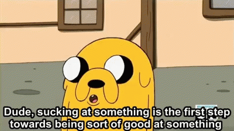

## About Me

Hi, I'm Nessa Jane (or NJ) — a Software Engineering Manager at Etsy, coach for lead engineers & people leaders, and an open-source enthusiast. I've been a software engineer for about 15 years, with experience across Ruby, Python, Node, Elixir, Erlang, Clojure, Haskell, Elm, and more. I'm especially passionate about functional programming and Linux. I've been a Linux nerd since age 12, back when ISOs came in magazines.

I got hooked on Linux at that age while starting a home recording studio and Googling “free recording software” because I didn’t have money of my own yet. This meant compiling audio drivers and acting as my own sysadmin just to get a microphone working. I even got my first job through a contact I met at a Linux User group with no idea you could get a job that way at the time.

I was the original author of [@christopheradams/elixir_style_guide](https://github.com/christopheradams/elixir_style_guide) before [@christopheradams](https://github.com/christopheradams) took it on. I've contributed to various open-source projects and was a technical reviewer for "Clojure Web Development Essentials" from Packt Publishing. Fun fact: A goofy contribution I made was jokingly adding HTTP status 418, "I'm a Teapot", to the Phoenix web framework.

I love collaboration and working with other engineers of all levels. Feel free to connect or check out more:
- [LinkedIn](https://linkedin.com/in/divergentmindsthrive)
- [Bluesky](https://bsky.app/profile/nessamurmur.bsky.social)
- [nessajane.tech](https://nessajane.tech) (personal blog)
- [divergentmindsthrive.com](https://divergentmindsthrive.com) (coaching)

> "Dude, sucking at something is the first step to being sorta good at something."  
> – Jake the Dog, Adventure Time
